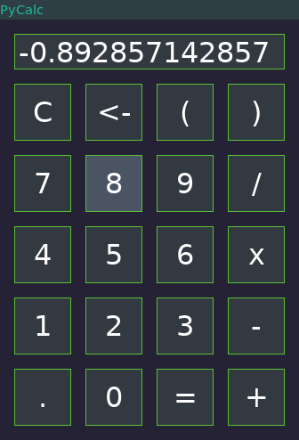
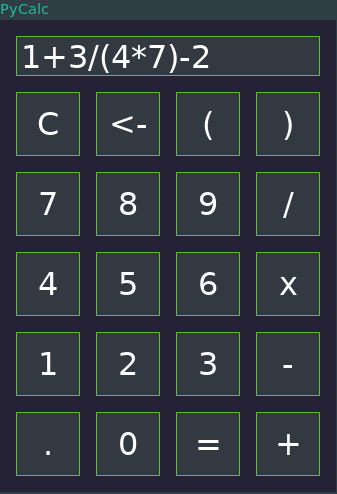
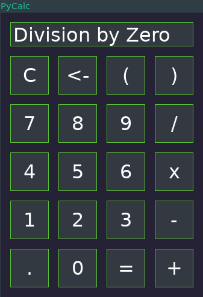

# PyCalc
Evaluates entered expressions using Python's eval function. Supports input through both buttons and keyboard.

## After entering input

## After evaluating input

## Upon entering incorrect input
